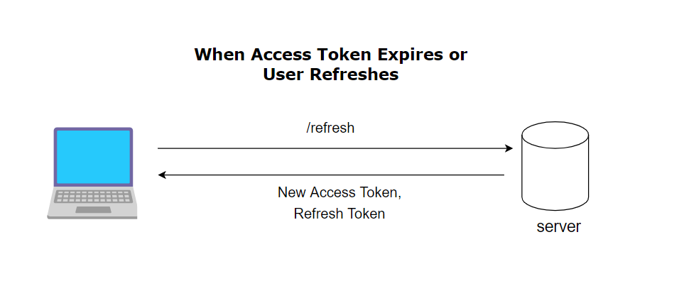

## 1. User action triggers the refresh

The user clicks a link or performs an action that requires authentication (for example: opening a protected page).

- The app checks the **access token**
- It is **expired or about to expire**
- The app decides: _“I need to refresh the token”_

👉 The user does **not** log in again.

---

## 2. Client sends a refresh request

The application (browser or mobile app):

- Sends a request to a **token refresh endpoint**
- Includes the **refresh token** (usually stored securely in an HTTP-only cookie or secure storage)

Important:

- The **access token is NOT trusted anymore**
- Only the **refresh token** is used at this point

---

## 3. Server receives the refresh request

The backend receives the request and:

1. Extracts the refresh token
2. Checks if it exists
3. Checks if it is **well-formed**
4. Checks if it is **expired**

If any of these fail → refresh is rejected.

---

## 4. Server validates the refresh token

The server now verifies that the refresh token:

- Was **issued by this server**
- Is **not revoked**
- Matches a stored record (database or cache)
- Belongs to a valid user
- Has not been reused (important for security)

This step prevents:

- Token theft
- Replay attacks
- Session hijacking

---

## 5. (Optional but recommended) Rotate the refresh token

In modern secure systems:

- The old refresh token is **invalidated**
- A **new refresh token** is generated

Why?

- If someone steals an old refresh token, it becomes useless
- This limits damage from leaks

---

## 6. Server issues a new access token

Once validated:

- A **new access token** is created
- It has a **short lifetime** (minutes)
- Contains updated user claims (role, permissions, etc.)

Optionally:

- A new refresh token is also issued

---

## 7. Server sends the response

The backend sends back:

- New access token (usually in the response body)
- New refresh token (usually as a secure cookie)

Security best practices:

- Refresh token → HTTP-only, Secure, SameSite cookie
- Access token → stored in memory (not localStorage)

---

## 8. Client updates its auth state

The frontend:

- Replaces the old access token
- Updates its authentication state
- Retries the original action (page load, API call, etc.)

To the user:  
👉 Everything feels **instant and invisible**

---

## 9. User continues normally

The user is now:

- Still authenticated
- No login prompt
- No page reload required (unless intentional)

The session continues seamlessly.

---

## 10. Failure scenario (important)

If the refresh token is:

- Expired
- Revoked
- Reused
- Missing

Then:

- The server rejects the refresh
- The client logs the user out
- The user must log in again

This is intentional and secure.

---

## Mental model (simple)

Think of it like:

- **Access token** = short-term key (badge)
- **Refresh token** = long-term ID (passport)
- Badge expires → show passport → get new badge

---
