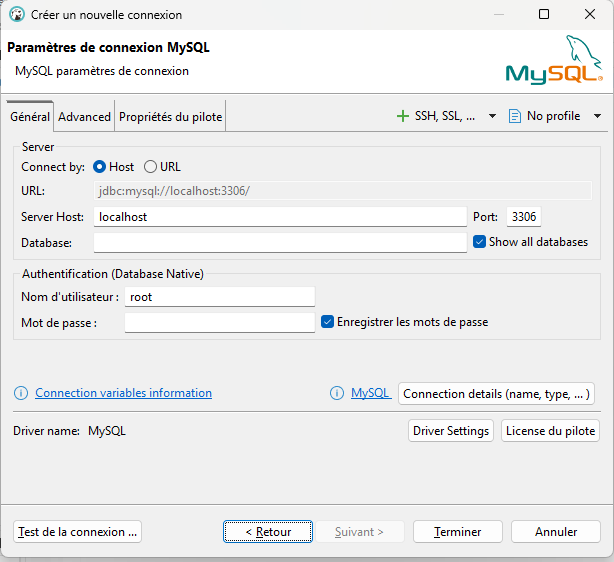

GitHub Repo : [node-mysql-express](https://github.com/Lil-Code30/node-mysql-express)

## Installing MySQL

This will be needed so that we can interact with the DB without the Node.js application for operations like creation of table, etc. The steps below are for Windows users:

1. Download MySQL from MySQL [website](https://dev.mysql.com/downloads/mysql/).
2. Install MySQL using the downloaded file and setup the root password.
3. Download MySQL Workbench from [MySQL website](https://dev.mysql.com/downloads/workbench/).
4. Install Workbench using the downloaded file.

## Installing DBeaver

An alternative vertion of MySQL workbench. While installing mySQL workbench, I had some errors and could not fix them so i switch to an alternative option

Download it here [DBeaver Community](https://dbeaver.io/). It is free and open source

## Setting up table and data

Open DBeaver

### Parameters Connection for MySQL

Create a new connection



### Create the Database and Table

- Run this query to create a new database:

```sql
CREATE DATABASE IF NOT EXISTS testdb;
```

- Run this query to use the above created database:

```sql
USE testdb;
```

- Run this create query to create a new table named users:

```sql
CREATE TABLE IF NOT EXISTS users (
id INT(11) UNSIGNED AUTO_INCREMENT PRIMARY KEY,
name VARCHAR(100) NOT NULL,
email VARCHAR(100) NOT NULL
);
```

- After the creation of the table run this command to insert some values into this table:

```sql
INSERT INTO users(name, email) VALUES
('John Doe', 'john.doe@example.com'),
('Jane Smith', 'jane.smith@example.com'),
('Alice Johnson', 'alice.johnson@example.com'),
('Bob Brown', 'bob.brown@example.com'),
('Charlie Davis', 'charlie.davis@example.com'),
('Eve White', 'eve.white@example.com'),
('Frank Black', 'frank.black@example.com'),
('Grace Green', 'grace.green@example.com'),
('Hank Blue', 'hank.blue@example.com'),
('Ivy Yellow', 'ivy.yellow@example.com');

```

## Setting up Express.js for a REST API

To set up a Node.js app with an Express.js server, first create a directory for the project to reside in:

```bash
mkdir node-mysql-express
cd node-mysql-express
npm init -y
```

### Install the required dependencies

To install Express nad mysql2

```bash
npm i express mysql2
```

Create a slim server in the server.js

./server.js

```js
omport express from 'express';
import mysql from 'mysql/promise';

var app = express();

const connection = await mysql.createConnection({
    host: '',
    user: 'root',
    password: 'admin',
    database: 'testdb'
});

const PORT = process.env.PORT || 8001

app.use(express.json())
app.use(
  express.urlencoded({
    extended: true,
  }),
)

app.get("/members", async function(req, res){
    const [members, fields] = await connection.query("SELECT * from testdb");

    res.send({members});
})

app.get("/", (req, res) => {
  res.json({ message: "ok" })
})

app.listen(PORT, () => {
  console.log(`Server listening at http://localhost:${PORT}`)
})
```

NOTE : This part should be your own content (informations) created above at section _Parameters Connection for MySQL_

```js
const connection = await mysql.createConnection({
  host: "",
  user: "root",
  password: "admin",
  database: "testdb",
})
```

## References

- [Getting started with Node.js and MySQL2](https://medium.com/@sahni_hargun/getting-started-with-node-js-and-mysql2-519407a8e7de)
- [How to Connect to a MySQL Database Using the mysql2 Package in Node.js?](https://www.geeksforgeeks.org/node-js/how-to-connect-to-a-mysql-database-using-the-mysql2-package-in-node-js/)
- [Build a REST API with Node.js, Express, and MySQL](https://blog.logrocket.com/build-rest-api-node-express-mysql/)
- [REST API with Node.js, Express.js and MySQL2](https://medium.com/@sahni_hargun/rest-api-with-node-js-express-and-mysql2-86ea9f1db2b7)
