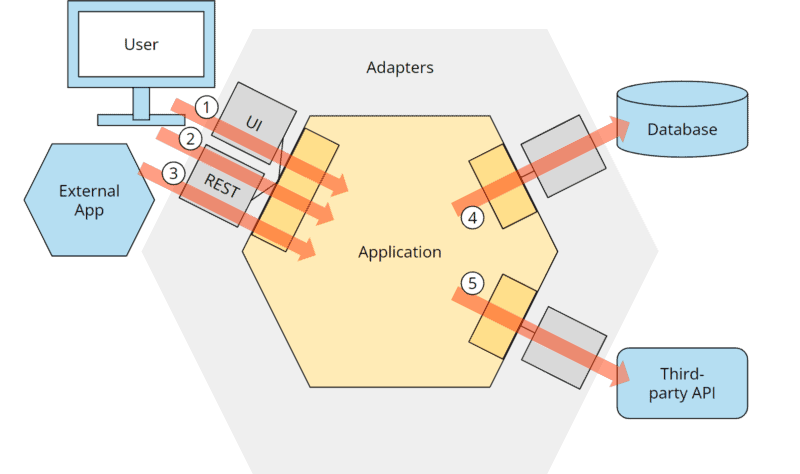

I Covered :

- Trying hexagonal architecture on my saas AcadXP
- Explain the concept of hexagonal architecture and how I am trying to implement it in my project.
- [Hexagonal Architecture Article](https://www.happycoders.eu/software-craftsmanship/hexagonal-architecture/)

- 
